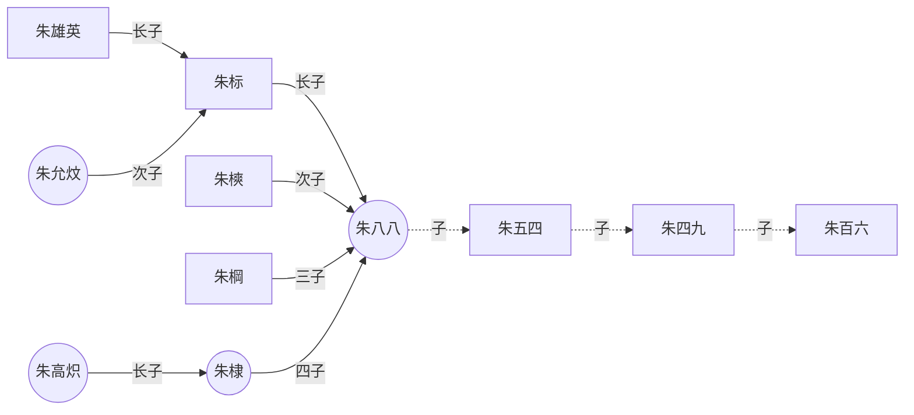
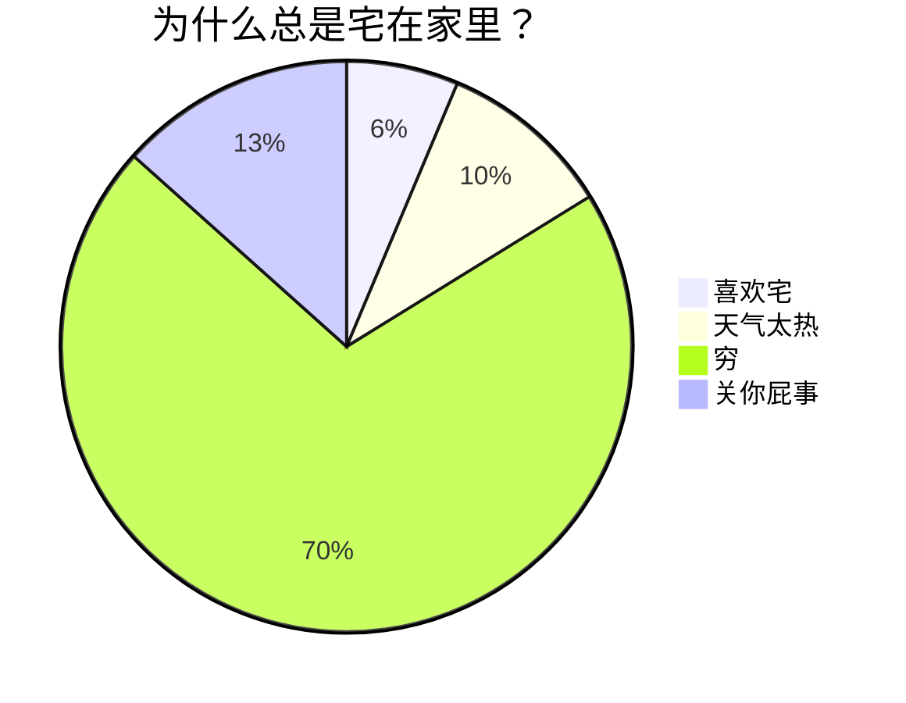
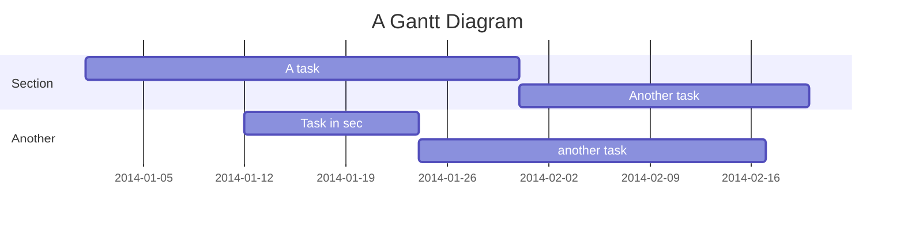

---
{"dg-publish":true,"dg-home":false,"permalink":"/markdown/MarkDown超级教程 by 成雙醬 - Obsidian中文教程 - Obsidian Publish/","dgPassFrontmatter":true,"created":"2024-10-26T21:13:56.152+08:00","updated":"2024-10-26T21:31:53.772+08:00"}
---

[MarkDown超级教程 by 成雙醬 - Obsidian中文教程 - Obsidian Publish](https://publish.obsidian.md/chinesehelp/01+2021%E6%96%B0%E6%95%99%E7%A8%8B/MarkDown%E8%B6%85%E7%BA%A7%E6%95%99%E7%A8%8B+by+%E6%88%90%E9%9B%99%E9%86%AC#17.+Mermaid) 

 最新全文在：

1.  **Markdown** 是一款轻量级标记语言，不同于HTML **(Hypertext Markup Language)**，**Markdown** 的语法非常简单 且 容易上手
2.  **Markdown** 以 **纯文本格式** 编写文档，依赖键盘而非鼠标，专注于**写作本身**，感受**书写**的魅力
3.  **Markdown** 的通过添加一些简单的 **标识符**，让文本具有**恰到好处**的格式
4.  **Markdown** 核心特征就是 **删繁剪芜**， **简扼** \+ **精炼**
5.  **Markdown**是 **笔记** 与 **网页文章** 的最佳载体
6.  **Down** 的核心：坐 **下** 来，就能把思维写 **下** 来
    *   **牛津高阶英汉双解词典第九版** 中，关于 **down** 的释义：


*   **Markdown** **书写软件** 推荐：**Typora** 优秀的 MD网页文章 书写软件
    *   [点击跳转下载地址](https://www.typora.io/ "Typora编辑器")
*   **Markdown** **笔记软件** 推荐：**Obsidian** **银河系最强** **MD+ 双向链** 笔记软件
    *   [点击跳转下载地址](https://obsidian.md/ "银河系第一笔记软件 Obsidian")

*   **提示1：**  本教程推荐使用 **Typora编辑器** 打开阅读
*   **提示2：**  下文提到的所有标识符都是 **英文状态** 的 **！**

*   Markdown标题共有 **六级**，和 HTML 一样
    
*   区分 **一级标题 → 六级标题**
    
    *   **标题 的格式：** 
        
        *   **#** × 标题级数 \+ **空格** \+ 文本内容

```
这是一段普通的文本

# 这是一级标题
## 这是二级标题
### 这是三级标题
#### 这是四级标题
##### 这是五级标题
###### 这是六级标题 
```

*   **目录的 格式：** 
    *   在文档的顶部 输入 **`[toc]`** ，会根据 **标题** 自动生成目录 ( **Table of Content** )
*   不是所有 **MD编辑器** 都支持目录生成

*   **斜体 的格式：** 
    
    1.  `*` \+ 文本内容 \+ `*`
    2.  `_` \+ 文本内容 \+ `_` ( 下划线 )
*   **说明：** 
    
*   斜体文本，首尾只有 **单个** 标识符
    

```
这是一段普通文本

*这里一段斜体文本*
_这也是一段斜体文件_ 
```

*   **粗体 的格式：** 
    
    1.  `**` \+ 文本内容 \+ `**`
    2.  `__` \+ 文本内容 \+ `__` (这里是两个 **_** )
*   **说明：** 
    
    *   粗体文本，首尾各有 **两个** 标识符

```
这是一段普通文本

**这里是一段加粗文本**
__这也是一段加粗文本__ 
```

*   **粗斜体 的格式：** 
    
    1.  `***` \+ 文本内容 \+ `***`
    2.  `___` \+ 文本内容 \+ `___` （ 这里是3个 _ )
    3.  `**_` \+ 文本内容 \+ `_**`
    4.  `__*` \+ 文本内容 \+ `*__`
    5.  `*__` \+ 文本内容 \+ `__*`
    6.  `_**` \+ 文本内容 \+ `**_`
*   **说明：** 
    
    *   粗斜体文本，首尾各有 **三个** 标识符

```
这是一段普通文本

***粗斜体文本1***
___粗斜体文本2___
**_粗斜体文本3_**
*__粗斜体文本5__*
_**粗斜体文本6**_ 
```

*   **斜体中包含粗体 的格式：** 
    
    1.  `*` \+ 斜体文本 \+ `**` \+ 粗体文本 \+ `**` \+ 斜体文本 \+ `*`
    2.  `_` \+ 斜体文本 \+ **`__`** \+ 粗体文本 \+ `__` \+ 斜体文本 \+ `_` （ 这里是两个 **_** )
    3.  `*` \+ 斜体文本 \+ `__` \+ 粗体文本 \+ `__` \+ 斜体文本 \+ `*`
    4.  `_` \+ 斜体文本 \+ `**` \+ 粗体文本 \+ `**` \+ 斜体文本 \+ `_`
*   **说明：** 
    
    *   **斜体** 中包含 **粗体**，其实就是嵌套的关系，**外层** 是 **斜体**，**内层** 是 **粗体**
    *   外层是**斜体**，标识符是**单个**；内层是**粗体**，标识符是**两个**
    *   因为 **粗体** 是被包裹在 **斜体** 中的，所以显示效果为 **斜粗体**

```
这是一段普通文本

*这是一段斜体中**包含粗体**的文字*
_这也一段斜体中**包含粗体**的文字_
*这又是一段斜体中__包含粗体__的文字*
_这还是一段粗体中**包含粗体**的文字_ 
```

*   **粗体中包含斜体 的格式：** 
    1.  `**` \+ 粗体文本 \+ `*` \+ 斜体文本 \+ `*` \+ 粗体文本 \+ `**`
    2.  `__` \+ 粗体文本 \+ `_` \+ 斜体文本 \+ `_` \+ 粗体文本 \+ `__` （ 这里是两个 **_** )
    3.  `**` \+ 粗体文本 \+ `_` \+ 斜体文本 \+ `_` \+ 粗体文本 \+ `**`
    4.  `__` \+ 粗体文本 \+ `*` \+ 斜体文本 \+ `*` \+ 粗体文本 \+ `__`
*   **说明：** 
    *   **粗体** 中包含 **斜体**，也是嵌套的关系，**外层** 是 **粗体**，**内层** 是 **斜体**
    *   外层是**粗体**，标识符是**两个**；内层是**斜体**，标识符是**单个**
    *   因为 **斜体** 是被包裹在 **粗体** 中的，所以显示效果为 **粗斜体**

```
这是一段普通文本

**这是一段粗体中*包含斜体*的文字**
__这也是一段粗体中_包含斜体_的文字__
**这又是一段粗体中_包含斜体_的文字**
__这还是一段粗体中*包含斜体*的文字__ 
```

*   **删除线 的格式：** 
    *   **`~~`** \+ 文本内容 +**`~~`** 首尾各加两个 **~** 波浪号

*   下划线的格式，和 HTML 是一样的
    *   **`<u>`** \+ 文本内容 \+ **`</u>`**

这是一段加了下划线的文本

*   **有序列表 的格式：** 
    
    *   **`1.`** \+ **空格** \+ 文本内容
*   **说明：** 
    
    *   输入文本内容后，敲击 **Enter** 自动补全格式，并进入 **下个** 有序列表
    *   若需要在同个列表内，增加 **换行显示** 的内容 (**但不进入下个列表**)  
        敲击 **Shift** \+ **Enter** ，即可另起一行输入文本
    *   在有序列表的中间，插入一个新的列表，后面列表的 **数字序号** 会自动 **递进** 一层
    *   即便在源代码模式中修改了数字序号，渲染界面依然是 **依照顺序** 显示的

```
1. 这是第一个有序列表 
2. 这是第二个有序列表 
3. 这是第三个有序列表 

1. 这是第一个有序列表 
   这是同个列表下，另起一行的文本内容 
2. 这是第二个有序列表 
   这是同个列表下，另起一行的文本内容 
```

1.  这是第一个有序列表
    
2.  这是第二个有序列表
    
3.  这是第三个有序列表
    
4.  这是第一个有序列表  
    这是同个列表下，另起一行的文本内容
    
5.  这是第二个有序列表  
    这是同个列表下，另起一行的文本内容
    

*   由于有序列表存在**强制排序性**，它的数字序号必然是**逐一递进**的  
    若你希望内容前的数字，不依照**递进顺序**排序，或者以 **整百**，**整十数** 排序
*   可以配合**无序列表**，在无序列表中输入：
    *   `数字` \+ `.` \+ 内容  
        \[注意](https://publish.obsidian.md/#%E6%B3%A8%E6%84%8F) 点号 与 内容 之间，**没有空格** (其实有空格也行，就是会感觉有点奇怪)

```
- 10.这是无序列表下，整十数排列的内容
- 20.这是无序列表下，整十数排列的内容
- 30.这是无序列表下，整十数排列的内容

- 100.这是无序列表下，整百数排列的内容
- 200.这是无序列表下，整百数排列的内容
- 300.这是无序列表下，整百数排列的内容 
```

**效果：** 

*   10.这是无序列表下，整十数排列的内容
*   20.这是无序列表下，整十数排列的内容
*   30.这是无序列表下，整十数排列的内容

*   100.这是无序列表下，整百数排列的内容
*   200.这是无序列表下，整百数排列的内容
*   300.这是无序列表下，整百数排列的内容

*   **无序列表 的格式：** 
*   **-** \+ **空格** \+ 文本内容
*   **说明：** 
    *   输入文本内容后，敲击 **Enter** 自动补全格式，并进入 **下个** 无序列表
    *   若需要在同个列表内，增加**换行**显示的内容 (**但不进入下个列表**)  
        敲击 **Shift** \+ **Enter** ，即可另起一行输入文本
*   **补充：** 
    *   在**Obsidian**中，按下 **Ctrl** \+ **Enter**
    *   即可快速生成一个无序列表

```
- 这是第1个无序列表 
- 这是第2个无序列表 
- 这是第3个无序列表

- 这是第一个无序列表 
  这是同个列表下，另起一行的文本内容
- 这是第二个无序列表 
  这是同个列表下，另起一行的文本内容 
```

*   这是第1个无序列表
*   这是第2个无序列表
*   这是第3个无序列表

*   这是第一个无序列表  
    这是同个列表下，另起一行的文本内容
*   这是第二个无序列表  
    这是同个列表下，另起一行的文本内容

*   **引用 的格式：** 
    *   **>** \+ 文本内容 （**不需要空格**)
*   **说明：** 
    *   **同个引用段落**内的换行直接敲击 **Enter** 即可
    *   若需添加 **第二个独立引用段落** ，连续敲击 **两下** **Enter** 即可

```
>这是第一段引用文本的第1行 <!-- (Enter) -->
>这是第一段引用文本的第2行 <!-- (Enter) -->
<!-- (Enter) -->
>这是第二段引用文本的第1行 <!-- (Enter) -->
>这是第二段引用文本内第2行 
```

> 这是第一段引用文本的第1行  
> 这是第一段引用文本的第2行

> 这是第二段引用文本的第1行  
> 这是第二段引用文本的第2行

**在列表和引用的书写过程中，我们需要利用 缩进 与 退格 ，让文章肌理分明，更具层级**

*   **缩进：** 
    1.  **Tab**
    2.  **Ctrl** \+ **\[**   (左中括号)
*   **退格：** 
    1.  **Shift** \+ **Tab**
    2.  **Ctrl** \+ **\]** （右中括号）

```
1. 第一级有序列表1 
 1. 第二级有序列表1 
 2. 第二级有序列表2 
2. 第一级有序列表2 
```

*   **补充说明：** 
    *   有序列表的**数字序号**，即便你在源代码模式里 强行改掉 数字，它仍然会 **依照顺序** 显示

1.  第一级有序列表1
    1.  第二级有序列表1
    2.  第二级有序列表2
2.  第一级有序列表2

```
- 第一级无序列表1 
 - 第二级无序列表1 
 - 第二级无序列表2 
- 第一级无序列表2 
```

*   第一级无序列表1
    *   第二级无序列表1
    *   第二级无序列表2
*   第一级无序列表2

*   引用的 **缩进** 和列表 **不同**
    *   引用需另起一行，并额外多打一个 > 来完成 **缩进**
*   引用的 **退格** 与列表 **相同**
    1.  **Shift** \+ **Tab**
    2.  **Ctrl** \+ **\]** （右中括号）

```
>第一级引用1 
>>第二级引用1 
>>第二级引用2 
>第一级引用2 
```

> 第一级引用1
> 
> > 第二级引用1  
> > 第二级引用2
> 
> 第一级引用2

*   **补充：**   
    在 **Obsidian** 中，引用的退格是不太一样的
*   **Obsidian** 中，如果想让已经缩进的引用 **退回一层**
    *   得使用 **`Shift`** \+ **`Enter`** ，配合方向键，在多个 **`>`** 之间灵活断行  
        并在下一行 根据需要 选择性补充 **`>`**
*   这个用文字比较难以描述，这里选择用2个带键位的 **Gif图** 来描述

**Gif演示1：** 


> 111
> 
> > 222
> > 
> > > 333
> 
> > 444
> > 
> > > 555
> > 
> > 666
> 
> 777

*   **有序列表**、**无序列表**、**引用** 三者之间，可以相互嵌套
*   **核心键** ： **Shift** \+ **Enter** **&** **Enter** **&** **Shift** \+ **Tab** ( 或 **Ctrl** \+ **\[** )
    *   **Shift** \+ **Enter** 在切换格式的嵌套中，是 自带一层 **缩进** 效果的

```
1. 第一级 有序列表1  
 - 第二级 无序列表1 
 >第三级 引用1 
 - 第四级 无序列表2 
 1. 第五级 有序列表2 
 - 第四级 无序列表3 
 >第三级 引用2 
 - 第二级 无序列表4 
2. 第一级 有序列表3 
```

1.  第一级 有序列表1
    
    *   第二级 无序列表1
        
        > 第三级 引用1
        > 
        > *   第四级 无序列表2
        >     1.  第五级 有序列表2
        > *   第四级 无序列表3
        > 
        > 第三级 引用2
        
    *   第二级 无序列表4
        
2.  第一级 有序列表3
    

*   **Obsidian** 在列表首行使用缩进的时候，后续的列表会出现一些问题
    *   `Tab` 和 `Shift + tab` 会无法 缩进 退格
        *   可以使用 `Ctrl + ]` 与 `Ctrl + [` 来解决问题

```
- - 这是第一段就被缩进的列表
	- 这是第二段被再次缩进的列表  
  - 这是第三段列表 
```

*   *   这是第一段就被缩进的列表
        *   这是第二段被再次缩进的列表
    *   这是第三段列表

*   **网页链接的 格式：** 
    *   **\[** \+ 显示文本内容 \+ **\]** \+ **(** \+ 链接地址 \+ **空格** \+ **"** \+ 提示信息文本 \+ **"** \+ **)**
*   **说明：** 
    *   显示文本内容，是在渲染界面实际 **可见** 的文本，用以 **说明** 链接
    *   提示信息文本，需鼠标悬停于 **显示文本内容** 方可触发，用于增加额外提示信息
        *   **`"提示信息文本"`** 是可选项，可填可不填
        *   一般来讲，需按住 **Ctrl** \+ **`鼠标左键点击`** 才可跳转链接，不过也有 **直接鼠标点击** 就能跳转的

```
[显示文本内容](链接地址 "提示信息文本")

[百度一下，你就知道](http://www.baidu.com "按住Ctrl点击跳转百度") 
```

**示范：** 

*   **图像格式：** 
    *   图像格式，就是在网页链接前面加个 **!** (英文格式的)，**`!`** 代表 **可见**
    *   图片的提示信息，和网页链接一样，写在 **`" "`** 内
    *   **`[ ]`** 方括号里的文字信息在 **Markdown** 没啥实质的作用，只是方便在源代码模式下，知道这个图片是什么，在渲染界面是不会显示的。有点类似于HTML **img标签** 里的 **alt属性**。

```
	

 
```

*   **补充：** 
    
    *   图像链接可以是**本地**的，也可以是**在线**的
        
        *   本地图像直接 **`Ctrl + C`** 黏贴，**`Ctrl + V`** 复制 就可以
        *   在线图像推荐使用 [图床](https://imgtu.com/ "这是一个在线图床网址")
    *   调整图像的大小需要使用 HTML 和 CSS，在 **Typora编辑器** 中右键可以直接缩放图片  
        本质是转成了HTML的格式，最后会有一个 `style="zoom: %;"` ，这里数值可以自己修改
        
    *   如果有使用 **Obsidian** 的朋友，在线图片链接是通用的，不过因为**Obsidian** 是双向链笔记
        
        它的本地图片的格式是：
        
        *   **`![[ 图片 ]]`**
            *   本质是为图片建了一个新的MD文件，用 **!** 使它可见
            *   **Obsidian**的图片设置大小是用 | 分隔后面跟宽度数值，单位是px。  
                设置好宽度，高度会自动 **等比例调整**
                *   **`![[图片名|宽度数值]]`**


*   Markdown的表格，比HTML简单很多
    *   **|** 是构成表格的主要 **框架**
    *   **-** 区分 **表头** 和 **表格主体**
    *   **:** 控制 表格内 **文本内容** 的 **对齐方式**
    *   **Typora编辑器中** 输入 **`Ctrl + T`** 即可快速插入表格，自由定义样式

```
|这里是表头1|这里是表头2|这里是表头3|
|:-|:-:|-:|    
|单元格数据1|单元格数据2|单元格数据3|
|单元格数据4|单元格数据5|单元格数据6| 
```

| 这里是表头1 | 这里是表头2 | 这里是表头3 |
| --- | --- | --- |
| 单元格数据1 | 单元格数据2 | 单元格数据3 |
| 单元格数据4 | 单元格数据5 | 单元格数据6 |

*   Mardown中表格，它的宽高是由 单元格数据内的文本内容 **撑开** 的
*   当我们输入一段很长很长的文本，它所在的单元格会变得过宽

**如下图所示：** 

| 表头1 | 表头2 |
| --- | --- |
| 这是一段很长很长很长很长很长很长很长很长很长很长很长很长很长很长的文本 | 普通文本 |

*   若想对一段长文本进行换行，可以在 **中间** 插入一个 **`<br>`** （ 换行标签 )

```
| 表头1 |  表头2 |
|:-:|:-:|
|这是第一行文本<br>这是另起一行的文本|普通文本| 
```

| 表头1 | 表头2 |
| --- | --- |
| 这是第一行文本  
这是另起一行的文本 | 普通文本 |

*   **行内代码 的格式：** 
    
    *   输入两个 **`** 反撇号 ，在中间写代码内容
*   **补充：** 
    
    *   行内代码不一定非得写代码，也可以作为**`着重标记`**，突出显示内容
    *   行内代码中，源代码界面和渲染界面是完全一致的，标识符会失效
    *   **所谓行内代码：** 只要你的屏幕足够宽，它就不会换行

```
`这是一段行内代码`

`<table border="1" cellspacing="0" width="500" height="500">`

`print("Hello, World!")`

`这是一行突出显示的文本内容` 
```

`<table border="1" cellspacing="0" width="500" height="500">`

`print("Hello, World!")`

`这是一行突出显示的文本内容`

*   **代码块 的格式：** 
    
    1.  在首行和末行各加 **三个** **`** 反撇号
    
    *   **` ``` `** \+ 语言种类  
        代码内容  
        **` ``` `**
    
    2.  在首行和末行各加 **三个** **~** 波浪号
        *   **`~~~`** \+ 语言种类  
            代码内容  
            **`~~~`**
*   **补充：** 
    *   在代码块也不一定要写代码，可以写**一段**突出的文本内容，语言类型可以填写 **txt** 或者 **干脆不写**
    *   代码块中，源代码界面和渲染界面是完全一致的，标识符会失效
    *   在 **Typora编辑器** ，用键盘按键脱离代码块区域，需输入： **Ctrl \+ Enter**

```
```语言种类
代码内容
代码内容
代码内容
```

下面是HTML代码块

```html
<table border="1">
    <tr>
        <td>row 1, cell 1</td>
        <td>row 1, cell 2</td>
    </tr>
    <tr>
        <td>row 2, cell 1</td>
        <td>row 2, cell 2</td>
    </tr>
</table>
```

下面是CSS代码块

```css
.box {
	width: 600px;
	height: 400px;
	margin: 100px auto;
	background-image: linear-gradient(black 33.3%,red 33.3%, red 66.6%, yellow 66.6%, yellow);
} 
```

下面是JavaScript代码块

```js
 var arr = [2, 4, 6, 8, 10, 12, 14, 16, 18, 20, 22, 24, 26, 28, 30, 32, 34, 36, 38, 40, 42, 44, 46, 48, 50, 52, 54, 56, 58, 60]
    var newarr = [];
    for (var i = 0, count = 0, sum = 0, len = arr.length; i < len; i++) {
        sum += arr.shift();
        count++;
        if (count % 5 === 0) {
            newarr.push(sum / 5);
            sum =  0;
        }
    }
    console.log(newarr);

    var arr = [2, 4, 6, 8, 10, 12, 14, 16, 18, 20, 22, 24, 26, 28, 30, 32, 34, 36, 38, 40, 42, 44, 46, 48, 50, 52, 54, 56, 58, 60]
    var newarr = [];
    for (var i = 0, len = arr.length; i < len / 5; i++) {
        var subarr = arr.splice(0, 5)
        for (var j = 0, sum = 0; j < subarr.length; j++) {
            sum += subarr[j];
        }
        newarr.push(sum / 5);
    }
    console.log(newarr);
```

下面是Python代码块

```python
 i = 2
while(i < 100):
   j = 2
   while(j <= (i/j)):
      if not(i%j): break
      j = j + 1
   if (j > i/j) : print i, " 是素数"
   i = i + 1
 
print "Good bye!"
```

下面是一块突出显示的文本

```txt
这是一段
突出显示的
文本内容
``` 
```

```
<table border="1">
    <tr>
        <td>row 1, cell 1</td>
        <td>row 1, cell 2</td>
    </tr>
    <tr>
        <td>row 2, cell 1</td>
        <td>row 2, cell 2</td>
    </tr>
</table> 
```

```
.box {
	width: 600px;
	height: 400px;
	margin: 100px auto;
	background-image: linear-gradient(black 33.3%, red 33.3%, red 66.6%, yellow 66.6%, yellow);
} 
```

```
 var arr = [2, 4, 6, 8, 10, 12, 14, 16, 18, 20, 22, 24, 26, 28, 30, 32, 34, 36, 38, 40, 42, 44, 46, 48, 50, 52, 54, 56, 58, 60]
    var newarr = [];
    for (var i = 0, count = 0, sum = 0, len = arr.length; i < len; i++) {
        sum += arr.shift();
        count++;
        if (count % 5 === 0) {
            newarr.push(sum / 5);
            sum =  0;
        }
    }
    console.log(newarr);

    var arr = [2, 4, 6, 8, 10, 12, 14, 16, 18, 20, 22, 24, 26, 28, 30, 32, 34, 36, 38, 40, 42, 44, 46, 48, 50, 52, 54, 56, 58, 60]
    var newarr = [];
    for (var i = 0, len = arr.length; i < len / 5; i++) {
        var subarr = arr.splice(0, 5)
        for (var j = 0, sum = 0; j < subarr.length; j++) {
            sum += subarr[j];
        }
        newarr.push(sum / 5);
    }
    console.log(newarr); 
```

```
 i = 2
while(i < 100):
   j = 2
   while(j <= (i/j)):
      if not(i%j): break
      j = j + 1
   if (j > i/j) : print i, " 是素数"
   i = i + 1
 
print "Good bye!" 
```

*   **任务列表 的格式：** 
    
    *   **-** \+ **空格** +**`[ ]`** +**空格** \+ 任务列表内容 ( 中括号`[ ]` 里面必须有个空格)
    *   给待办任务列表打 **`√`** ，变成 **已办**
        1.  在渲染界面，直接鼠标左键点击框框
        2.  在源代码界面，在中括号内输入 **英文字母x**
            *   部分编辑器，在 中括号内 输入**任意字符**都可以打 **`√`** ( 例如 **Obsidian** )
*   **补充：** 
    
    *   大部分 MD编辑器 支持输入第一个任务列表后，按下 **Enter** 进入下一行会 **自动补全待办格式**
    *   在**Obsidian**中，连续输入**两次** `Ctrl + Enter` ，即可生成一个待办列表
        *   再输入一次 `Ctrl + Enter` ，会在待办列表 打 **`√`**
*   **格式：** 
    

```
- [ ] 待办任务列表1
- [ ] 待办任务列表2
- [x] 已办任务列表1    
- [x] 已办任务列表2 
```

*   待办任务列表1
*   待办任务列表2
*   已办任务列表1
*   已办任务列表2

*   在 **Obsidian** 中，可以利用 **Ctrl** \+ **Enter** ，快速生成任务列表
    1.  **`-`** \+ **空格** \+ **Ctrl** \+ **Enter** +待办文本内容
    2.  待办文本内容 \+ **Ctrl** \+ **Enter** **×2**   ( 输入文本后，连续2次 `Ctrl + enter` )

*   **任务列表也是可以缩进+退格的，操作跟 无序、有序列表一样**

*   第一级待办列表1
    *   第二级待办列表1  
        另起一行的第二级待办列表1
        *   第三级已办列表1
        *   第三级已办列表2
    *   第二级待办列表2  
        另起一行的第二级待办列表2
*   第一级待办列表2

**Markdown** 的 **注释** 和 **HMTL** 一样，注释的内容在 **渲染界面** **不可见** （部分编辑器可见)

*   **注释 的格式：** 
    *   `<!-- 这里是注释的内容 -->`
        *   注释可以是单行，也可以是多行
    *   如果有在使用 **Obsidian** 的，它的注释格式是不一样的
        *   **`%%这是Obsidian的注释内容%%`**

*   **网页链接变量 的格式：** 
    1.  首先输入
        *   **`[显示文本内容]`** \+ **`[变量名]`**
            *   变量名可以自己取，没啥限制，任意字符都可以
    2.  在文档任意一个区域，输入：
        *   **`[变量名]`** \+ **:** \+ **空格** \+ 链接地址 （这个**空格** 不打也没事)

```
[百度一下，你就知道][度娘]
[知乎-有问题，就会有答案][知乎]

[度娘]: http://www.baidu.com 
[知乎]: https://www.zhihu.com 
```

*   **脚注 的格式：** 
    *   在需要脚注的地方，输入：
        *   **`[^脚注代号]`** ( 脚注代号会直接显示在渲染界面 )
            *   脚注代号可以随便命名，不过推荐使用 **数字序号**
    *   在其他区域，输入：
        *   **`[^脚注代号]`** \+ **:** +**空格** \+ 脚注内容 （这个 **空格** 不打也没事)

```
鲁迅原名是什么[^1] ，浙江哪里人[^2]

[^1]: 周树人
[^2]: 绍兴人 
```

*   **Markdown** 想实现更多的文本显示效果，只能依赖HTML标记实现
*   个人**不是很推荐**在 MD 中使用 HTML，不过一些简单的标记还是可以 **轻度使用** 的

*   **键盘文本的 格式：** 
    
    *   **`<kbd>键盘文本</kbd>`**
    *   **`<kbd>Ctrl</kbd> + <kbd>X</kbd>`**
*   **效果：** 
    
    *   **键盘文本**
    *   **Ctrl** \+ **X** ( 剪切 )
*   **说明：** 
    
    *   键盘文本也不一定非得是键盘按键，也可以作为**着重文本**突出显示
        *   **效果：** 这也算是一种着重文本的方式

*   **放大文本 的格式：** 
    
    *   **`这是一段普通文本`**  
        `<big>这是一段放大文本</big>`
*   **效果：** 
    
    *   这是一段普通文本  
        这是一段放大文本

*   **缩小文本 的格式：** 
    
    *   **`这是一段普通文本`**  
        **`<small>这是一段缩小文本</small>`**
*   **效果：** 
    
    *   这是一段普通文本
        
        这是一段缩小文本
        

*   **多彩文本 的格式：** 
    
    *   **`<font color=orange>这是一段橘色文本</font>`**
*   **效果：** 
    
    *   这是一段橘色文本
        *   color 里的颜色支持 英文单词，**[16进制](http://c.runoob.com/front-end/55 "可跳转至菜鸟教程了解")，[rgb](https://www.runoob.com/cssref/func-rgb-css.html "可跳转至菜鸟教程了解")，[rgba](https://www.runoob.com/cssref/func-rgba.html "可跳转至菜鸟教程了解")**
*   **多彩加粗文本：** 
    
    *   只需要在上面示例的基础上，为里面的文本内容加上 **加粗标识符**
        *   **格式：**  `<font color=teal>**这是一段加粗的水鸭色文本**</font>`
        *   **效果：**  **这是一段加粗的水鸭色文本**
    *   在部分编辑器中(例如**Obsidian**)，MD与HTML的混搭会导致 **样式失效** ，可以使用纯HTML标记
        *   **格式：**  `<strong style="color:teal;">这是一段加粗的水鸭色文本</strong>` (标记略复杂，不是很推荐)
        *   **效果：**  **这是一段加粗的水鸭色文本**
*   **！注意：**  多彩文本尽量慎用，**Markdown** 的核心就是 **简洁精炼**，注重 **实质内容**，而非花哨的 颜色样式
    

*   拓展显示效果既不是原生 **Markdown语法** 支持的，也非 HTML标记，而是部分编辑器 提供的 **额外标识符**，属于拓展语法，旨在为 **Markdown使用者** 提供更多样式选择
*   不同编辑器，支持不一样，这里以 **Typora编辑器** 为例

*   **文本高亮 的格式：** 
    *   **`==这里是一段高亮文本==`**
*   **效果：** 
    *   这里是一段高亮文本

*   用一对 **^** 包裹 (**Shift\+ 6**)
    *   **格式：**  **`x^2^`**
    *   **效果：**  x^2^
*   **Obsidian** 没效果的，可以用后面会讲的 **Latex**
*   或者，也可以使用 **HTML标记**
    *   `<sup>这里是上标内容</sup>`
    *   `X<sup>2</sup>`
*   **效果：** 
    *   **X2**

*   用一对 **~** 包裹 (**Shift \+ `**)
    *   **格式：**  **`H~2~O`**
    *   **效果：**  H~2~O
*   **Obsidian** 没效果的，可以用后面会讲的 **Latex**
*   或者，也可以使用 **HTML标记**
    *   `<sub>这里是下标内容</sub>`
    *   `H<sub>2</sub>O`
*   **效果：** 
    *   **H2O**

*   用一对 : 包裹，里面是 **Emoji** 符号的 **语义化文本** ( **Typora编辑器** 中，输入 `:` 就会带提示器 )
    
    *   **示例：** 
        
        *   `:smile:`  
            `:sweat:`  
            `:cat:`  
            `:woman_cartwheeling:`
    *   **效果：** 
        
        *   :smile:  
            :sweat:
            
            :cat:  
            :woman_cartwheeling:
            
    *   **补充：** 
        
        *   不支持上述方式的 MD编辑器或笔记软件，直接用 **输入法** 输入也是可以的
        *   **Windows系统** 用户 **win \+ .** 就可以输入 Emoji 了

*   在 **Markdown** 中，我们 通过 **标识符** 改变 **文本显示效果**
    
*   现在我们希望它不作为标识符，而是 **作为字符本身呈现出来** （不具备改变文本显示效果的功能，只是一个**普通字符**)
    
    *   首先我们可以用前面介绍的 **代码域** ，因为代码模式的显示效果就是源代码**完全一致**的
        
    *   还有一种方法，可以利用转义字符，在这些标识符 **前面** 加上 **反斜线** **\** ( 反斜线要紧贴在标识符前面，**不能** 有 **空格** )
        
        *   **原理：** 
            
            *   **`\`** 的作用是让标识符 **转义** 变为一个**普通字符**，完成这个效果后，反斜线会**自动隐藏**
            *   隐藏后的反斜线仅在**源代码**界面**可见**，在**渲染**界面**不可见**
            *   反斜线只**争对标识符**起作用，其他字符添加 **`\`**，**`\`** 不会自动隐藏
        *   **补充：** 
            
            *   如果想给已经被加在标识符前面，会自动隐藏的 **`\`** 显示出来，可以在反斜线前面再加一个 **\** ，用它**自己来转义自己**
                *   **示例：**  **`这里紧跟在标识符前面的反斜线 \\*会被转义成普通字符显示出来，不会自动隐藏`**
                *   **效果：**  这里紧跟在标识符前面的反斜线 \\*会被转义成普通字符显示出来，不会自动隐藏

*   如何让被一对或多对 **`*`** 号 包裹的文本内容，能够正常显示 **`*`** ，且文本不改变格式
    *   `\*这段文本被一对星号包裹，但不会倾斜\*`
        *   **效果：**  *这段文本被1对星号包裹，但不会倾斜*
    *   `\*\*这段文本被2对星号包裹，但不会加粗\*\*`
        *   **效果：**  **这段文本被2对星号包裹，但不会加粗**
    *   `\*\*\*这段文本被3对星号包裹，但它既不倾斜也不加粗\*\*\*`
        *   **效果：**  ***这段文本被3对星号包裹，但它既不倾斜也不加粗***

*   在表格中，使用 **|** 作为单元格的内容，但**不会**被识别为**表格的结构**，不会增加额外的单元格

```
|表头1|表头2|
|-|-|
|这里的文本被\|分隔|这里的文本也被\|分隔| 
```

| 表头1 | 表头2 |
| --- | --- |
| 这里的文本被|分隔 | 这里的文本也被|分隔 |

*   在行内代码中，让反撇号 **`** 能被显示出来，有两种方法
    
    1.  首尾用**两个引号**包裹  
        **`` `显示2个反撇号` ``** ， **`` `显示单个反撇号  ``**
    
    *   **效果：**  **`` `显示两个反撇号` ``** ， **`` `显示单个反撇号``**
    *   **注意：**  中间的内容 距离首尾引号 各有1个空格
    
    2.  之前提过，行内代码也可作为 突出显示的文本  
        可以利用前面介绍的 键盘文本 \+ 转义符号 **`\`** ，突出显示反撇号
        
        *   **格式：**  **``<kbd>\`首尾的反撇号会正常显示\`</kbd>``**
        *   **效果：**  `首尾的反撇号会正常显示`

在 **网页链接** 的 **显示文本内容** 中，使用 **中括号** **`[ ]`**

*   在显示文本内容中，在其中一个中括号前面，加上**转义符号** 反斜杠 **\**
    *   **格式：**  **`[链接里的 \[中括号\] 能被正常显示](https://www.runoob.com)`**
    *   **效果：**  [链接里的 \[中括号\] 能被正常显示](https://www.runoob.com/)

*   引用一段话，一般会在换行之后，加上 **`- 出处`**
    
*   因为 **-** 是标识符，会变成一个无序列表
    

**如下所示：** 

> The Web, the Tree, and the String.  
> 写作之难，在于把网状的思考，用树状结构，体现在线性展开的语句里。
> 
> *   史蒂芬·平克

*   **解决方法：** 
    
    *   在 **-** 前面加上 转义符号 **\**
    
    ```
    >The Web, the Tree, and the String.
    >写作之难，在于把网状的思考，用树状结构，体现在线性展开的语句里。
    >\- 史蒂芬·平克 
    ```
    
*   **效果：** 
    

> The Web, the Tree, and the String.  
> 写作之难，在于把网状的思考，用树状结构，体现在线性展开的语句里。  
> \- 史蒂芬·平克

*   在一些编辑器或者支持MD的笔记软件里，无论你打多少个**空格**，它只会显示单个 **空格** 的距离
    
    *   可以使用 HTML中 **空格** 的 **字符实体** —— **`&nbsp;`**
    *   若要添加 **多个** 空格，就输入多个 —— **`&nbsp;&nbsp;&nbsp;&nbsp;&nbsp;&nbsp;&nbsp;`**
*   **格式：** 
    
    *   **`这里有&nbsp;&nbsp;&nbsp;&nbsp;&nbsp;&nbsp;6个空格分隔`**
*   **效果：** 
    
    *   这里有      6个空格分隔

**场景1：** 

*   在一些编辑器或者支持MD的笔记软件里，无论你打多少个 **回车**，它只会显示单个 **回车** 的空行间距
    *   可以使用之前表格里提到的 **`<br>`** 标签，在 **单独一行** 中使用，增加额外的空行间距
    *   如果要增加 **多个**，就输入 **多个** —— **`<br><br><br><br><br>`**
    *   **注意：**  当单独一行使用 `<br>` 标签的时候，如果前后有标题标识符或者列表标识符，确保 **br标签** 前后两行都是空白行
*   **格式：** 

```
这里第一段文本

<br><br><br><br><br>     

这里是第二段文本 
```

**场景2：** 

```
- 这是一段无序列表
  <br>     
  这是同一段无序列表中，空一行距离显示的内容
- 这是第二段无序列表 
```

**效果：** 

*   这是第一段无序列表
    
    这是同一段无序列表中，空一行距离显示的内容
    
*   这是第二段无序列表

*   **补充：** 
    *   有一些MD编辑器或笔记软件，严格遵循MD的换行规则，你敲一个回车是没法换行的，必须在 **行末** 敲 **2个空格**，再按回车键
        *   **格式：** 
            *   这里是一段想换行的文本空格 空格 Enter  
                这是换行后的文本

*   很多编辑器都有英文标点自动补全功能，自动生成一对，光标落在中间  
    只想删除前面1个，却会把 **一整对** 都删掉
*   在多个列表的嵌套中，也许会遇到一些 **无法被删除** 的 **列表标识符**
*   **解决方法：**   
    使用 **`Shift`** \+ **`Backspace`** 即可强制删除
    *   **Bcakspace**   ( 退格键 )

*   **格式：** 
    
    *   **`<audio controls="controls" preload="none" src="音频链接地址"></audio>`**
*   **示例：** 
    

```
<audio controls="controls" preload="none" src="https://www.ldoceonline.com/media/english/exaProns/p008-001803372.mp3?version=1.2.30"></audio> 
```

```
<video width="600" height="420" controls>
  <source src="movie.mp4" type="video/mp4">
  <source src="movie.ogg" type="video/ogg">
  <source src="movie.webm" type="video/webm">  
</video> 
```

*   **说明：** 
    
    *   width ( 宽度 ) height ( 高度 ) ，可以自己设置，直接输入数字即可，单位默认是 px(像素)  
        也可以使用 **百分比**  
        **`width=100%`** 代表水平撑满整个窗口  
        **`height=50%`** 代表垂直撑满半个窗口
    *   **Video标签** 支持的视频格式 ：MP4 ogg webm

*   **格式：**  **`<iframe width=600 height=400 src="页面链接地址" scrolling="auto" border="0" frameborder="no" framespacing="0" allowfullscreen="true"> </iframe>`**

```
<iframe width=600 height=400 src="https://www.runoob.com/html/html-tutorial.html" scrolling="auto" border="0" frameborder="no" framespacing="0" allowfullscreen="true"> </iframe> 
```

*   **iframe标签** 除了嵌入页面，也可以嵌入**在线视频**，主流的视频网站都会提供**嵌入代码**
    
    *   具体可以看这个 [iframe视频嵌入教程](https://www.wolai.com/wolai/go85vJpt3wDwrid7DfCZcE)
    *   **B站** 的视频，得在 **`//`** 前面补充 **`http:`**
    *   不是所有的 编辑器和笔记软件 都支持这个
*   **示例：** 
    

```
<iframe width=600 height=400 src="http://player.bilibili.com/player.html?aid=20190823&bvid=BV1yW411s7og&cid=32964980&page=1" scrolling="no" border="0" frameborder="no" framespacing="0" allowfullscreen="true"> </iframe> 
```

*   **示例：** 
    
    *   **`$x^2 + 2x + 5 + \sqrt x = 0$`**
        
        **`$\ce{CO2 + C -> 2 CO}$`**
        

```
$
$\ce{Zn^2+  <=>[+ 2OH-][+ 2H+]  $\underset{\text{amphoteres Hydroxid}}{\ce{Zn(OH)2 v}}$  <=>[+ 2OH-][+ 2H+]  $\underset{\text{Hydroxozikat}}{\ce{[Zn(OH)4]^2-}}$}$
$


$
\begin{array}{lll}
\nabla\times E &=& -\;\frac{\partial{B}}{\partial{t}}   
\ \nabla\times H &=& \frac{\partial{D}}{\partial{t}}+J   
\ \nabla\cdot D &=& \rho
\ \nabla\cdot B &=& 0
\ \end{array}
$ 
```

```

```

子

子

子

长子

长子

次子

次子

三子

四子

长子

朱八八

朱五四

朱四九

朱百六

朱雄英

朱标

朱允炆

朱樉

朱棡

朱棣

朱高炽

```

```

为什么总是宅在家里？6%10%70%13%为什么总是宅在家里？喜欢宅天气太热穷关你屁事

```
```mermaid
sequenceDiagram
	
	autonumber
	
        participant A as Aly
        participant B as Bob
        participant C as CofCai
        
        Note left of A: 只复习了一部分
        Note right of B: 没复习
        Note over A,B: are contacting
        
        A->>B: 明天是要考试吗？
        B-->>A: 好像是的！
        
        
        
        rect rgb(0, 25, 155)
            par askA
                C -->> A:你复习好了吗？
            and askB
                C -->> B:你复习好了吗？
            and self
                C ->>C:我还没准备复习......
            end
        end
        
        
        rect rgb(25, 55, 0)
            loop 自问/Every min
            
            C ->> C:我什么时候<br/>开始复习呢？
            end
        end
        
        
        rect rgb(153, 83, 60)
            alt is good
                A ->> C:复习了一点
            else is common
                B ->> C:我也是
            end
            
            opt Extra response
                C ->> C:你们怎么不回答我
            end
        endsequenceDiagram
	
	autonumber
	
        participant A as Aly
        participant B as Bob
        participant C as CofCai
        
        Note left of A: 只复习了一部分
        Note right of B: 没复习
        Note over A,B: are contacting
        
        A->>B: 明天是要考试吗？
        B-->>A: 好像是的！
        
        
        
        rect rgb(0, 25, 155)
            par askA
                C -->> A:你复习好了吗？
            and askB
                C -->> B:你复习好了吗？
            and self
                C ->>C:我还没准备复习......
            end
        end
        
        
        rect rgb(25, 55, 0)
            loop 自问/Every min
            
            C ->> C:我什么时候<br/>开始复习呢？
            end
        end
        
        
        rect rgb(153, 83, 60)
            alt is good
                A ->> C:复习了一点
            else is common
                B ->> C:我也是
            end
            
            opt Extra response
                C ->> C:你们怎么不回答我
            end
        end
``` 
```

AlyBobCofCai只复习了一部分没复习are contactingpar\[askA\]\[askB\]\[self\]loop\[自问/Everymin\]alt\[is good\]\[is common\]opt\[Extraresponse\]明天是要考试吗？1好像是的！2你复习好了吗？3你复习好了吗？4我还没准备复习......5我什么时候开始复习呢？6复习了一点7我也是8你们怎么不回答我9AlyBobCofCai

```

```

A Gantt Diagram2014-01-052014-01-122014-01-192014-01-262014-02-022014-02-092014-02-16A task Task in sec another task Another task SectionAnotherA Gantt Diagram